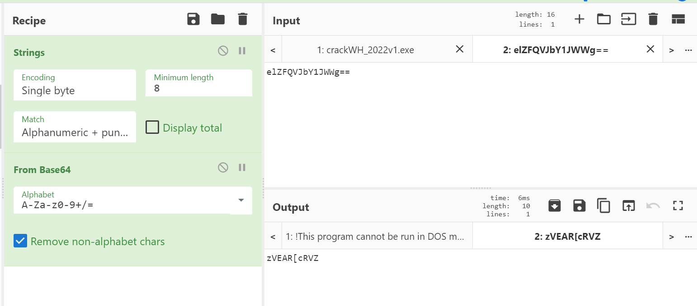
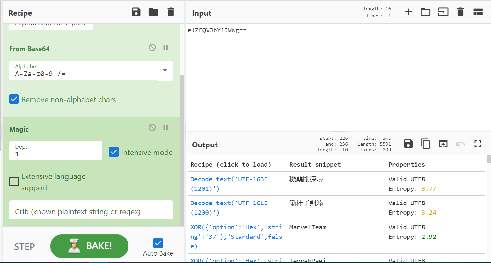

3 SOLVES 992 points

# DESCRIPTION
Author: Ahmad Abdillah, Systems Engineer, CSA

Difficulty: Medium

Reverse engineer the executable file to obtain the password (in the format of the flag). Use a disassembler to understand how the program works.
---
we did not manage to solve this
# SOLUTION
- ironically, you can solve this entire challenge in cyberchef.
- while looking through the program on IDA, I found this odd base64 string: `elZFQVJbY1JWWg==`

- after decoding the string, most people gave up since it looked like gibberish.

- some madlad used the cyberchef magic function and got the flag.

- there. wrap it, and WH2022{MarvelTeam}
### comments
outstanding flag creation from CSA